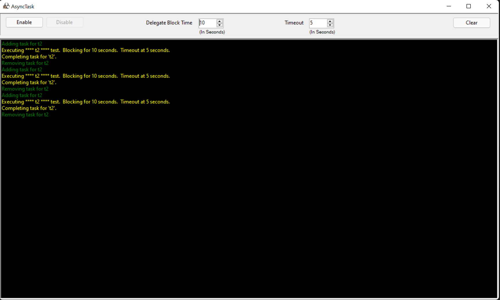

# AsyncTask
### Asynchronous Task Extension Library

---

<table>
<tr>
<th></th>
<th>Description</th>
</tr>
<tr>
<td>CREATED BY:</td>
<td>[Latency McLaughlin]</td>
</tr>
<tr>
<td>UPDATED:</td>
<td>4/13/2024</td>
</tr>
<tr>
<td>FRAMEWORK:</td>
<td>net452, netstandard2.0, netstandard2.1, net9.0</td>
</tr>
<tr>
<td>LANGUAGE:</td>
<td>[C#] preview</td>
</tr>
<tr>
<td>OUTPUT TYPE:</td>
<td>Library [API]</td>
</tr>
<tr>
<td>SUPPORTS:</td>
<td>[Visual Studio]</td>
</tr>
<tr>
<td>GFX SUBSYS:</td>
<td>[None]</td>
</tr>
<tr>
<td>TAGS:</td>
<td>[API], [TAP], [TPL], [.NET], [Core], [ORM], [IoC], [DI], [Generics], [Delegates], [EventHandlers], [Parametric-Polymorphism]</td>
</tr>
<tr>
<td>STATUS:</td>
<td></td>
</tr>
<tr>
<td>LICENSE:</td>
<td></td>
</tr>
<tr>
<td>VERSION:</td>
<td></td>
</tr>
<!-- VERSION: 3.1.0-preview.9 -->
</table>

## Model-View-Controller / Adapter Dynamically Linked Library ([MVC]/[MVA] [DLL])

### Task-based Asynchronous Pattern ([TAP])

## Screenshots

### WinForms

### WPF

## Navigation
* <a href="#background">Background</a>
* <a href="#introduction">Introduction</a>
* <a href="#overview">Overview</a>
* <a href="#installation">Installation</a>
* <a href="#output">Output</a>
* <a href="#other">Other features</a>
* <a href="#references">References</a>
* <a href="#issues">Report An Issue</a>
* <a href="#donation">Donation</a>
* <a href="#license">License</a>

<h2><a name="background">Background</a></h2>

There have been many instances throughout my career where incompetent developers try to release code to the company and its stakeholders which deadlock underlying dependency OSI layers which hinder project performance and scheduling.
Those tasked to sustain code as dependency will be frustrated debugging these efforts when trying to qualify responsibility of failure.

The goal was to develop an [API] that would be universal and simple to use in helping eliminate any '<i>concerns</i>' a.k.a cohesive areas of functionality, by wrapping amateur developers efforts with ease and addressing cross-cutting/horizontal concerns as well.
The goal was to reduce time & development costs in validating efforts for risk mitigation serving as a universal multi-functional paradigm.
Any developer can therefore use it to construct new code with the same underlying mechanics and reduce boilerplate code.

Some nice things about the C# language is that it is far superior to Java and can detect within a certain tolerance what the type might be so that the type parameter can be omitted from its calling convention.
Note that both languages have Reflection built-in, which technically makes it is possible to drill down many OSI layers and pull out information used for dynamic / RT calling conventions.

Java has limitations and has nothing to offer of greater value which is described here for [Comparison].
In fact, our methodology for this article is to use '<i>generic programming</i>'; a feature set of Java not properly supported since reflection in Java cannot be used to construct new generic realizations nor allows generics directly for primitive types.

<h2><a name="introduction">Introduction</a></h2>

This article introduces an [API] which wraps processes asynchronously; supporting deadlock protection, timeout, cancellation requests, checkpointing, and a parametric polymorphic [MVC] design by convention.

Callback support for the following delegates:
* OnAdd
* OnRemove
* OnComplete
* OnError
* OnCanceled
* OnTick
* OnTimeout

[AsyncTask] is compiled as a library packaged for the [NuGet] marketplace.  The project itself, supplies an application driver, test suite, and the library's source code.

Model-View-Controller ([MVC]) is an architectural pattern that separates application's data model and user interface views into separate components. This is what the definition says. However, to fully understand the [MVC] we have to introduce required terms and point benefits of [MVC].

The view is a user interface element (typically a window) that presents the data to the user and allows the user to change the data. It is a typical situation to have several views active at the same time (for example in the Multiple-Document Interface).

The controller is a connection point between the model and views: views register in the controller and reports changes in the model to them.

Forget about the [data model](Properties/DataModel.md) and focus on replacing this with an adapter.  Model–view–adapter [MVA] or mediating-controller [MVC] is a software architectural pattern and multitier architecture.
The model–view–adapter solves this rather differently from the model–view–controller by arranging model, adapter or mediating controller and view linearly without any connections whatsoever directly between model and view.

What do you call something that has connections directly related?   Dependancies!  If a dependancy breaks down, so does the rest of the system.  Think about it!  In an alternative scenario, you can use [DI] to replace additional constraints that may be binded as well.   This is where aspect oriented programming ([AOP]) will reduce the amount of boilerplate code which in effect also reduces the maintence efforts and cost along with the project size and complexity.

---

This API has several benefits, such as:

-- *[AsyncTask] helps you to know exactly what your code does.*
* Removes pitfalls, anti-patterns, and programming mistakes.
* Eliminate code redundancy.
* Reusable functional procedural code.
* Decrease RAD time.
* Optomizes performance of asynchronous code.
* Fix performance problems easily.
* Inject delegates in real time.
* Reduce boilerplate code.

-- *Flexible delegate injection for any situation.*
* Dependancy injection: 
  Design patterns that implement inversion of control for resolving dependencies.
* Labmda expressions: 
  An anonymous function that you can use to create delegates or expression tree types and supersede anonymous methods for writing inline code.
* Anonymous methods: 
  Constructs a way to pass a code block as a delegate parameter used in building up the *TaskEvent* class.
* Generic types: 
  Independant type parameters act as a placeholder for a specific type that a client specifies when they instantiate a variable of the generic type.

<h2><a name="overview">Overview</a></h2>

* <b>Graphical user interface samples.</b> 
 A clever user-interface is included which offers a view to spawn and cancel tasks.

* <b>Async / Await support.</b> 
 Task monitoring and dispatching utilizes [TPL] found in [.NET]'s v4+ async [API] which is fully supported by every task is wrapped and invocated based on its delegate.  Tightly coupled integration of multi-threaded delegates with composite [TPL] mechanics to offer thread-safe immediate and explicit timeout and termination functionality.   

* <b>Create reusable parametric polymorphic / [lambda expression] / FP methods in code.</b> 
 When running your tests, it might be that you want to create a sample of functional or regressive tasks.  Interchanging the delegates make it easy.  For example, switching contexts from an administrator area in your [CMS] / web-application.

* <b>Task Parallel Library ([TPL]) concurrent scheduling.</b> 
 [AsyncTask] uses a wrapping factory for the delegates supplied as its generic type. It doesn't matter whether your application uses multiple event handlers with specific listeners for each.  This [API] will consolidate those into a universal system regardless of type.   It will reduce the boilerplate code and overhead which will ultimately reduce the overall risk of failure since everything will funnel through the same sub-system.

<h2><a name="installation">Installation</a></h2>

This library can be installed from [NuGet].

<h2><a name="output">Output</a></h2>

<h2><a name="other">Other Features</a></h2>

- Unit Tests: 
  The unit test uses [NUnit] to help qualify the underlying [API].   Included is a sample that can be ran and tested againsted a variety of mock senario conditions.
- UI Application: 
  In addition to being able to use the [API] library as standalone, the project consists of a user-interface I developed using [WPF].

<h2><a name="references">References</a></h2>

 [TPL], [.NET], [ORM], [IoC], [DI], [Generics], [Delegates], [EventHandlers], [Parametric Polymorphism]

<h2><a name="issues">Report An Issue</a></h2>
If you have a patch to contribute, a feature to request, or a bug to report, please post to the [Issue Tracker](https://github.com/Latency/AsyncTask/issues).

<h2><a name="donation">Donation</a></h2>
If you want to donate to my efforts on this project, please use the following link,

<h2><a name="license">License</a></h2>

The source code for the site is licensed under the MIT license, which you can find in
the [MIT-LICENSE].txt file.

All graphical assets are licensed under the
[Creative Commons Attribution 3.0 Unported License](https://creativecommons.org/licenses/by/3.0/).

[//]: # (These are reference links used in the body of this note and get stripped out when the markdown processor does its job.)

   [GNU LESSER GENERAL PUBLIC LICENSE]: <http://www.gnu.org/licenses/lgpl-3.0.en.html>
   [Comparison]: <https://en.wikipedia.org/wiki/Comparison_of_C_Sharp_and_Java>
   [NuGet]: <https://www.nuget.org/packages/AsyncTask/>
   [.NET]: <https://en.wikipedia.org/wiki/.NET_Framework/>
   [WPF]: <https://en.wikipedia.org/wiki/Windows_Presentation_Foundation/>
   [Visual Studio]: <https://en.wikipedia.org/wiki/Microsoft_Visual_Studio/>
   [Latency McLaughlin]: <https://www.linkedin.com/in/Latency/>
   [API]: <https://en.wikipedia.org/wiki/Application_programming_interface>
   [AOP]: <https://en.wikipedia.org/wiki/Aspect-oriented_programming>
   [Parametric Polymorphism]: <https://en.wikipedia.org/wiki/Parametric_polymorphism>
   [AsyncTask]: <https://github.com/Latency/AsyncTask/>
   [TAP]: <https://msdn.microsoft.com/en-us/library/hh873175(v=vs.110).aspx>
   [AMI]: <https://en.wikipedia.org/wiki/Asynchronous_method_invocation>
   [TPL]: <https://msdn.microsoft.com/en-us/library/dd460717(v=vs.110).aspx>
   [ORM]: <https://en.wikipedia.org/wiki/Object-relational_mapping>
   [C#]: <https://en.wikipedia.org/wiki/C_Sharp_(programming_language)>
   [DLL]: <https://en.wikipedia.org/wiki/Dynamic-link_library>
   [MVC]: <https://en.wikipedia.org/wiki/Model%E2%80%93view%E2%80%93controller>
   [MVA]: <https://en.wikipedia.org/wiki/Model%E2%80%93view%E2%80%93adapter>
   [CMS]: <https://en.wikipedia.org/wiki/Content_management_system>
   [IoC]: <https://msdn.microsoft.com/en-us/library/ff921087.aspx>
   [DI]: <https://en.wikipedia.org/wiki/Dependency_injection>
   [Generics]: <https://en.wikipedia.org/wiki/Generic_programming>
   [Delegates]: <https://msdn.microsoft.com/en-us/library/ms173171.aspx>
   [EventHandlers]: <https://msdn.microsoft.com/en-us/library/2z7x8ys3(v=vs.90).aspx>
   [NUnit]: <https://en.wikipedia.org/wiki/NUnit>
   [lambda expression]: <https://msdn.microsoft.com/en-us/library/bb397687.aspx>
